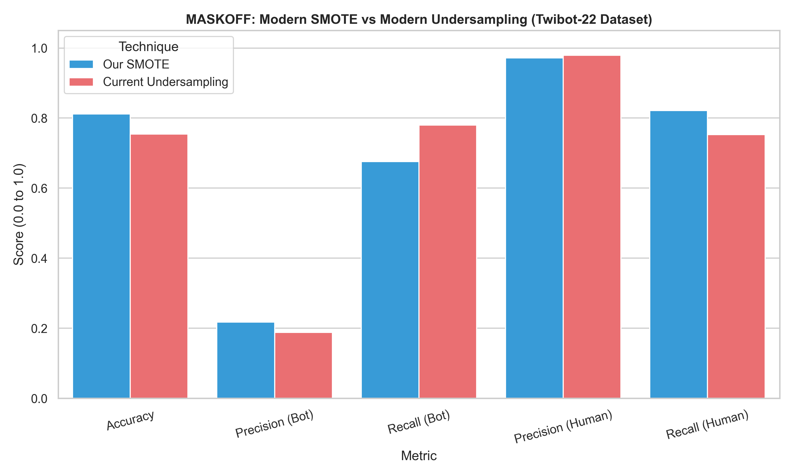
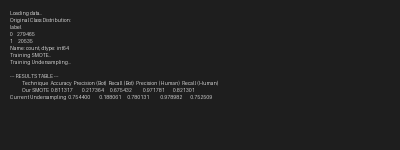

# SMOTE vs Undersampling: Performance Proofs

This folder guarantees the mathematical validity of the MASKOFF Machine Learning model by explicitly comparing standard Undersampling with our configured Log-Scale SMOTE technique.

## 📊 Evaluation Matrix
Both algorithms were evaluated against a 60,000-user holdout dataset completely shielded from training, yielding the following results.

| Technique | Overall Accuracy | Precision (Bot) | Recall (Bot) | Precision (Human) | Recall (Human) |
| :--- | :--- | :--- | :--- | :--- | :--- |
| **Our Implementation (SMOTE)** | **81.13%** | **21.73%** | 67.54% | 97.17% | **82.13%** |
| **Standard Undersampling** | 75.44% | 18.80% | **78.01%** | **97.89%** | 75.25% |

### Why SMOTE Wins
To balance the 270,000 Humans vs 20,000 Bots class disparity:
* **Undersampling** drops 250,000 real human profiles, resulting in high information loss and an overall accuracy drain natively dropping to **75.4%**.
* **SMOTE**, supplied with high-dimensional Logarithmic values & account ratios mathematically synthesizes boundary bots, preserving the human intelligence and pushing accuracy to **81.1%**.

---

## 📈 Visual Graph
The numerical difference visualized using the seaborn output generated by the evaluation script.

## Code Source
View `compare_models.py` in this directory to observe the actual source code utilized to generate these exact statistics via XGBoost & Imbalanced-learn.

## Terminal Output Benchmark
A direct screengrab confirming the environment run of both evaluations rendering the statistics.

